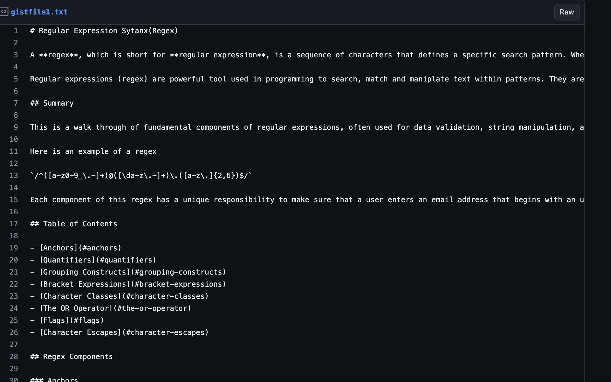
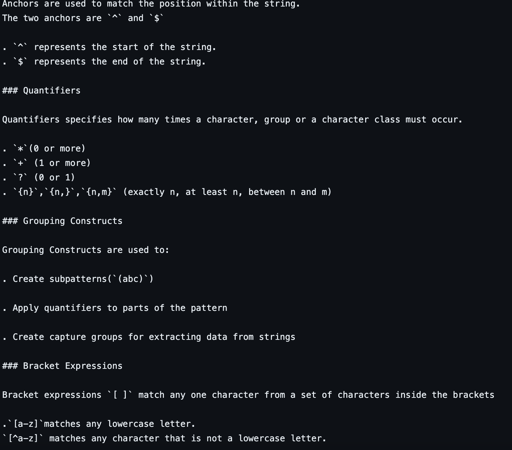

# 1: Regular Expression Sytanx(Regex)

## Introduction

Developers write code, but they also _write about code_.

This is walktrough and explains how a specific regular expression, or regex, functions by breaking down each part of the expression and describing what it does..

## Solution

GIVEN a regex tutorial
WHEN open the tutorial
THEN a descriptive title and introductory paragraph explaining the purpose of the tutorial, a summary describing the regex featured in the tutorial, a table of contents linking to different sections that break down each component of the regex and explain what it does, and a section about the author with a link to the author’s GitHub profile
WHEN clicked on the links in the table of contents
THEN taken to the corresponding sections of the tutorial
WHEN read through each section of the tutorial
THEN find a detailed explanation of what a specific component of the regex does
WHEN reached the end of the tutorial
THEN find a section about the author and a link to the author’s GitHub profile

Here's a snippet of my Github gist

